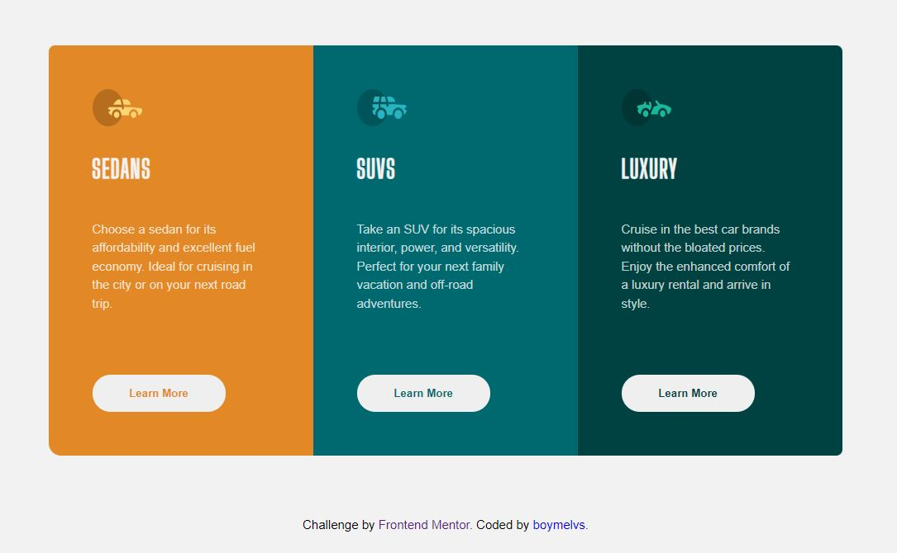

# Frontend Mentor - Order summary card solution

## Table of contents

- [Overview](#overview)
  - [The challenge](#the-challenge)
  - [Screenshot](#screenshot)
  - [Links](#links)
- [My process](#my-process)
  - [Built with](#built-with)
- [Author](#author)

## Welcome! 👋

Thanks for checking out this front-end coding challenge.

## Overview

This is a solution to the [3-column preview card component challenge on Frontend Mentor](https://www.frontendmentor.io/challenges/3column-preview-card-component-pH92eAR2-). Frontend Mentor challenges help you improve your coding skills by building realistic projects.

### The challenge

Users should be able to:

- Design 3-column preview card component
- View the optimal layout depending on their device's screen size
- See hover states for interactive elements

### Screenshot

### Links

- Solution URL: [My Solution](https://github.com/boymelvs/3-COLUMN-PREVIEW-CARD-COMPONENT.git)
- Live Site URL: [Live site](https://boymelvs.github.io/3-COLUMN-PREVIEW-CARD-COMPONENT/)

### Built with

- HTML
- Flexbox
- CSS
- Grid

## Author

- Frontend Mentor - [@boymelvs](https://www.frontendmentor.io/profile/boymelvs)
